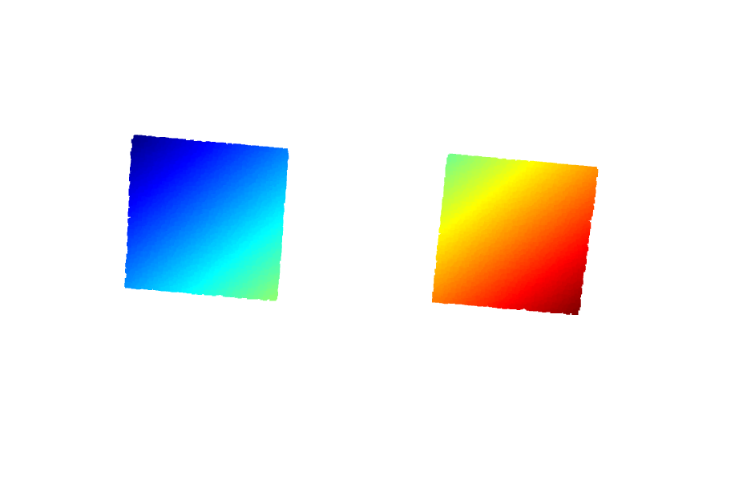

## 生成点云

PS：仓库中`pcd_merge.pcd`是生成的点云

```python
python GeneratePointcloud.py
```

生成的点云如下图：



## 一个真实的点云

真实的点云不知道为何在EC方法的耗时会高很多。该点云由激光雷达采集。


## 编译

```bash
cd PointcloudClustering
mkdir build
cd build
cmake ..
make
```

## 运行

```bash
cd PointcloudClustering
cd build
./ClusteringAlgo ../test_pcd.pcd
```

## 运行结果

```
Start pcl::EuclideanClusterExtraction ----------------------
Found 2 clusters.
Saved 27742 data points to euclidean_cluster_colored.ply.
Done in 5414.84 ms.
Done pcl::EuclideanClusterExtraction ----------------------
Start FastEuclideanClustering ----------------------
Found 2 clusters.
Saved 27742 data points to fec_cluster_colored.ply.
Done in 36.761 ms.
Done FastEuclideanCluster ----------------------
```